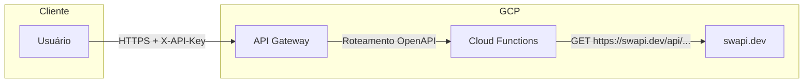

# Arquitetura Técnica - Star Wars Fan API

## Visão geral

A plataforma expõe uma API REST que agrega dados da [SWAPI](https://swapi.dev/) (Star Wars API), com filtros, ordenação, consultas correlacionadas e autenticação via API Key no GCP API Gateway.

## Diagrama de arquitetura

## Componentes

### 1. API Gateway (GCP)

- **Função**: Ponto único de entrada; validação de API Key; rate limiting; roteamento para a Cloud Function.
- **Configuração**: Especificação OpenAPI em `openapi/api_config.yaml` com `x-google-api-management.backends` apontando para a URL da Cloud Function.
- **Autenticação**: API Key no header `X-API-Key`. A validação é feita no gateway; a função recebe apenas requisições já autorizadas.

### 2. Cloud Functions (2ª geração, Python)

- **Runtime**: Python 3.11+.
- **Trigger**: HTTP. O entrypoint é `cloud_function_handler` em `api/main.py`, que adapta a requisição (estilo Flask) para o app FastAPI e devolve a resposta.
- **Estrutura**: Uma única função que despacha todas as rotas (`/films`, `/people`, `/planets`, `/starships` e sub-recursos) via FastAPI.

### 3. SWAPI (externo)

- **Base URL**: `https://swapi.dev/api/`
- **Recursos usados**: `people`, `films`, `planets`, `starships`.
- **Limites**: Sem autenticação; rate limit de ~10.000 requisições/dia por IP. Por isso a aplicação usa cache em memória (TTL configurável) para reduzir chamadas e melhorar latência.

## Fluxo de uma requisição

1. Cliente envia `GET /films/1/characters` com header `X-API-Key`.
2. API Gateway valida a API Key e encaminha para a Cloud Function (mesmo path e query).
3. A Cloud Function (FastAPI) roteia para o endpoint `GET /films/{film_id}/characters`.
4. O router obtém o filme na SWAPI (ou cache), depois resolve cada URL em `characters` via `get_by_url` (também com cache).
5. Resposta JSON é devolvida ao cliente.

## Cache

- **Onde**: Em memória no processo da Cloud Function (`api/services/swapi_client.py`).
- **Chave**: URL completa da requisição à SWAPI.
- **TTL**: Configurável por `CACHE_TTL_SECONDS` (padrão 300 s).
- **Efeito**: Menos chamadas à SWAPI, menor latência e respeito ao rate limit. Em ambiente com múltiplas instâncias, cada uma tem seu próprio cache (não distribuído).

## Decisão: API Gateway vs Apigee

Foi escolhido o **API Gateway do GCP** (não Apigee) para este case:

- Integração nativa com Cloud Functions e documentação clara.
- Menor custo e complexidade operacional para o escopo do desafio.
- Apigee seria mais indicado para cenários enterprise (políticas avançadas, monetização, múltiplos backends).

## Desenvolvimento local

Recomenda-se sempre usar um **ambiente virtual** (venv) antes de instalar dependências e rodar testes:

- Isola as bibliotecas do projeto do Python do sistema e de outros projetos.
- Evita conflitos de versão e garante que `pip install -r requirements.txt` afete só esse ambiente.
- A pasta do ambiente (ex.: `.venv`) já está no `.gitignore` e não deve ser versionada.

Passo a passo para criar e ativar o venv (Windows, Linux e macOS) está no [README](../README.md#ambiente-virtual-recomendado). Em resumo: `python -m venv .venv` e depois ativar com `source .venv/bin/activate` (Linux/macOS) ou `.venv\Scripts\activate` (Windows). Com o ambiente ativo, use `pip install -r requirements.txt` e `uvicorn api.main:app --reload`.

## Considerações

- **Cold start**: Na primeira requisição após um período ocioso, a função pode demorar alguns segundos para iniciar.
- **Limites da SWAPI**: Dados somente leitura; rate limit por IP; campos numéricos às vezes como string (`"unknown"`). A ordenação em memória trata esses casos.
- **Possíveis melhorias**: Apigee para políticas avançadas; Cloud Run se precisar de mais controle (concorrência, CPU/memória); cache distribuído (Firestore/Memorystore) para múltiplas instâncias.
